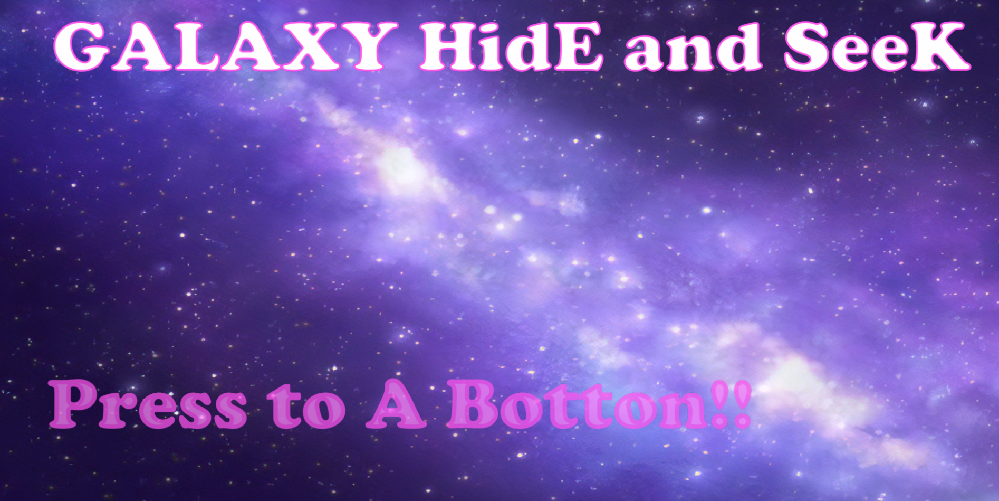
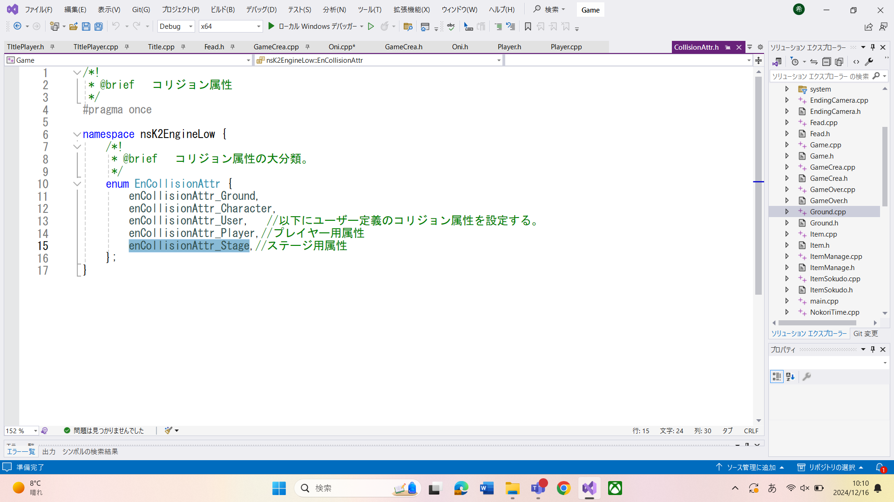
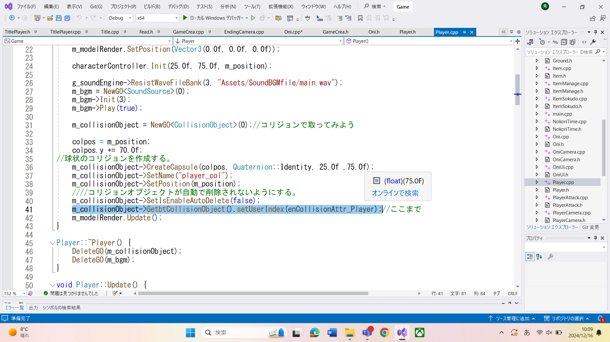
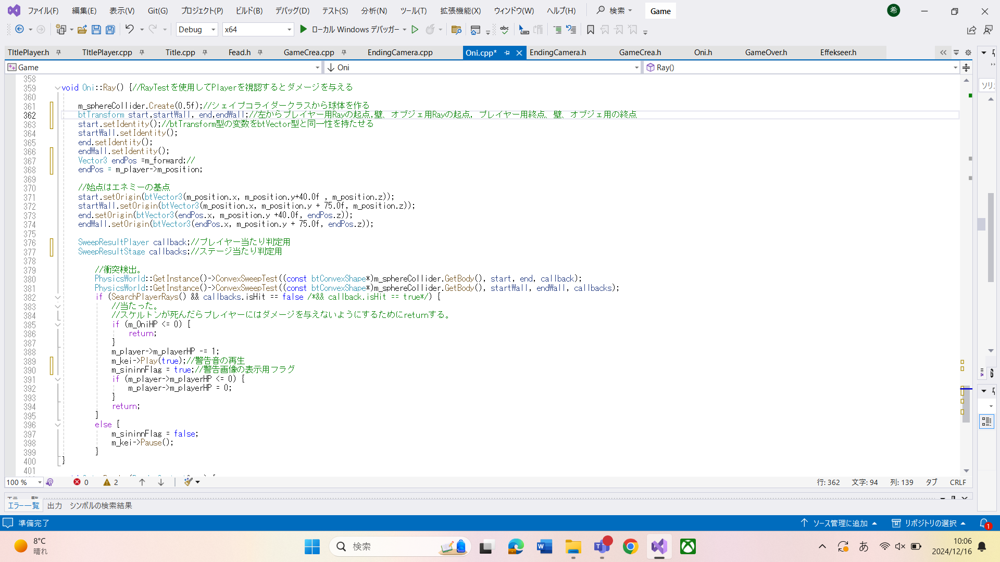
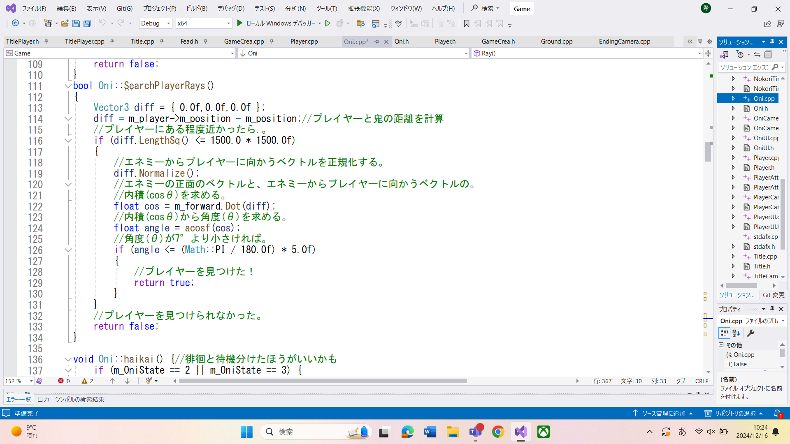

ゲームクリエイター科
１年 泉田希龍

### 概要
#### タイトル
	GALAXY HidE and SeeK

#### 制作人数
	1人
#### 制作期間
	2024年7月～2025年1月
#### ゲームジャンル
	アクションゲーム
#### 対応ハード
	Windows11
#### 使用言語
    C++
#### 使用ツール
*	プログラム(C++)\
o Visual Studio 2022
*	3Dソフト\
o	3ds Max
*	エフェクト\
o	Effekseer
*	画像\
o	Adobe Photoshop 2025

#### 開発環境
* エンジン\
	学内エンジン（DirectX12）
* OS\
	Windows11
#### ゲーム紹介
    隠れ鬼のように鬼から一定時間逃げ切るゲームです。
    クリア条件として逃げ切りのほかにファイヤーボールを使用し鬼を倒す方法もあります。
ゲーム紹介動画→
<https://youtu.be/f_ZLhn7eCAE>

    
### 技術紹介
* Ray\
  ゲームの要となる鬼が視認中にダメージを与えるシステムはエンジン内にあるSweepResult関数を使用して実装しました。\
  実装手順は以下の通りです。\
     ①CollisionAttr.hにあるenumに属性を追加する（画像１）\
②プレイヤーのStart関数でRay受付用のCollisionを作成しsetUserIndex関数を使用し①で用意した属性を与える。\
③このままじゃこのコリジョンは動かないのでプレイヤーに追従させるように動かす。\
④Rayの始点のクラス（今回はOni）で（画像3）のプログラムを用意する。\
＊各種関数の説明については画像内のコメントにて\
⑤当たったかどうかの判別をする構造体（struct(画像4)）を用意する。\
＊この時構造体名は変えなければならない（今回は SweepResultPlayer）\
⑥ダメージを与える条件を指定する\

 

* フェード\
今回ゲームのクオリティを向上させるために画像の透明度を変更するSetMulColor関数を使用しフェードを実装しました。\
これによりタイトル画面等のゲーム画面の切り替えが綺麗にすることができました。
* カメラ\
  今回のゲームではプレイヤー用カメラ、鬼の登場時用のカメラ、エンディング用カメラの3つのカメラを用意し場面によって切り替えるようプログラムを行いました。
* イージング\
  ゲームに躍動感を持たせるためにLarp関数を使用し徐々に移動させるイージングという機能を実装しました。\
  これによりエンディング時にカメラを自動的に動かし某会社の3Dアクションゲームのような演出を行えるようにしました。
* HPバー\
  キャラクターの体力を表示させるHPバーをだんだんと減らすために割合の計算とSetScale関数とSetPivot関数を使用します。
SetPivot関数を使うことで画像（今回で言うHPバー）の原点を変更することができます。
標準では(0.5,0.5)となっておりそのまま縮小していくと画像の真ん中に向かって減少していきますが右からだんだん減らすためにSetPivotのｘの値を0.0に変更しました。
コンストラクタ内で下記のコードが書けたらUpdate関数内で割合の計算を行い、その値をＨＰバーのSetScaleの値と掛け算を行うことでだんだん減らすことができるようになります。
.png>)
.png>)
HPが減ってる様子を動画にしました→
<https://youtu.be/-sNZkrm6lck>
  
* タイトルムービー\
  タートルに演出をつけようと思い、タイトル生成時にムービーを流すようにプログラムを行いました。\
  ムービーの動画→<https://youtu.be/sda5RmXZFzs>
* 今後やっていきたいこと\
  動く床や複数ステージを実装してパルクールに近い形に変更していきたいと考えています。
